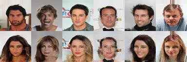
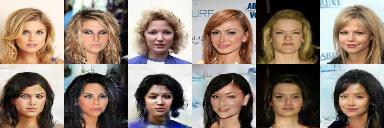
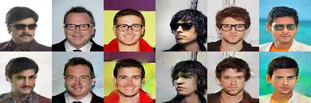
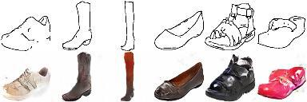
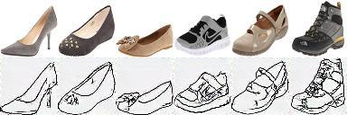
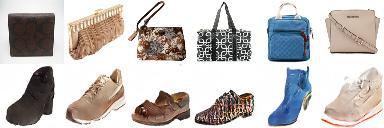
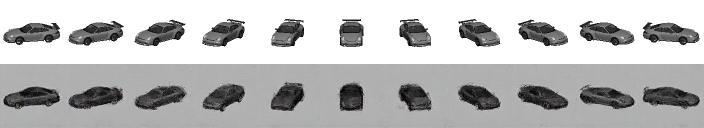
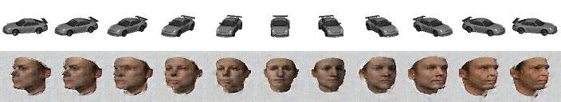
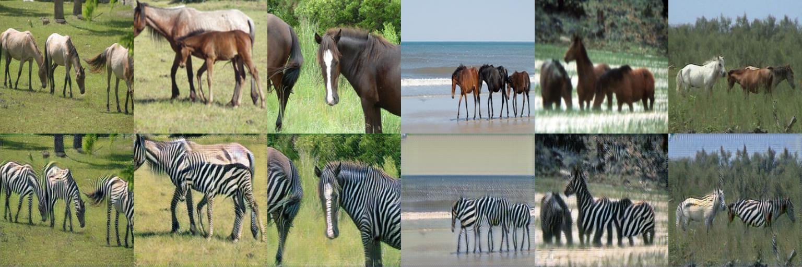
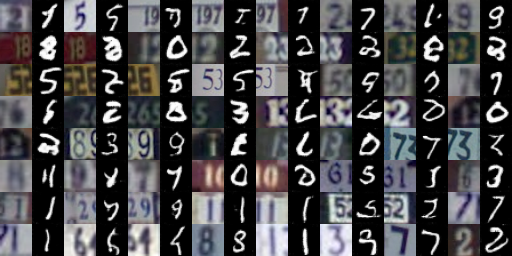

# DistanceGAN

Pytorch implementation of "One-Sided Unsupervised Domain Mapping" ([arxiv](https://arxiv.org/abs/1706.00826)). The implementation is based on the architectures of both [DiscoGAN](https://github.com/SKTBrain/DiscoGAN) and [CycleGAN](https://github.com/junyanz/pytorch-CycleGAN-and-pix2pix). 

Prerequisites
--------------
- Python 2.7
- Pytorch 0.1.12
- Numpy/Scipy/Pandas
- Progressbar
- OpenCV
- [visdom](https://github.com/facebookresearch/visdom)
- [dominate](https://github.com/Knio/dominate)

## Distance Model based on DiscoGAN architecture

### Download dataset
Download dataset [edges2shoes, edges2handbags, facecurb]:
python datasets/download.py $DATASET_NAME. 
Use ./datasets/combine_A_and_B.py to create handbags2shoes dataset.

Download seperately:
[celebA dataset](http://mmlab.ie.cuhk.edu.hk/projects/CelebA.html), 
[car dataset](http://www.scottreed.info/files/nips2015-analogy-data.tar.gz) used in [Deep Visual Analogy-Making](http://www-personal.umich.edu/~reedscot/nips2015.pdf) and
[head/face dataset](http://faces.cs.unibas.ch/bfm/main.php?nav=1-2&id=downloads).
Then extract into ./datasets folder. 

### CelebA training (Male to Female, Blond to Black hair, With Eyeglasses to Without Eyeglasses)
Male to Female:
python ./discogan_arch/distance_gan_model.py --task_name='celebA' --style_A='Male'

Blond to Black hair:
python ./discogan_arch/distance_gan_model.py --task_name='celebA' --task_name='celebA' --style_A='Blond_Hair' --style_B='Black_Hair' --constraint='Male' --constraint_type=-1

Eyeglasses to Without Eyeglasses:
python ./discogan_arch/distance_gan_model.py --task_name='celebA' --style_A='Eyeglasses' --constraint='Male' --constraint_type=1

### Edges, Handbags and Shoes (Edges to Shoes, Edges to Handbags, Shoes to Handbags)
Edges to Shoes:
python ./discogan_arch/distance_gan_model.py --task_name='edges2shoes' --num_layers=3

Edges to Handbags:
python ./discogan_arch/distance_gan_model.py --task_name='edges2handbags' --num_layers=3

Shoes to Handbags:
python ./discogan_arch/distance_gan_model.py --task_name='handbags2shoes' --starting_rate=0.5

### Car, Head/Face (Car to Car, Car to Head/Face, Head/Face to Head/Face)
Car to Car:
python ./discogan_arch/distance_gan_angle_pairing_model.py --task_name='car2car'

Head/Face to Head/Face:
python ./discogan_arch/distance_gan_angle_pairing_model.py --task_name='face2face'

Car to Head/Face:
python ./discogan_arch/distance_gan_angle_pairing_model.py --task_no ame='car2face'

### Options
Add following flags to python command as follows:

To train from A to B only: --model_arch=distance_A_to_B. To train from B to A only: --model_arch=distance_B_to_A. 

To add reconstruction/cycle loss to distance loss: --use_reconst_loss.

To use self distance instead of regular distance:--use_self_distance.

To avoid normalizing distances: --unnormalized_distances.

To change number of items used for expectation and std calculation: --max_items=NUM.

Additional options can be found in ./discogan_arch/discogan_arch_options/options.py

### Sample Results

Male to Female (First row is input and Second row is output):



Blond to Black Hair:



With to Without Eyeglasses:



Edges to Shoes:



Shoes to Edges:



Handbags to Shoes:



Car to Car:



Car to Head:



## Distance Model based on CycleGAN architecture

### Horse to Zebra:
Dataset: python datasets/download.py horse2zebra 

Train: python train.py --dataroot ./datasets/horse2zebra --name horse2zebra_distancegan --model distance_gan

Test: python test.py --dataroot ./datasets/horse2zebra --name horse2zebra_distancegan --model distance_gan --phase test

Results saved in ./results/horse2zebra_distancegan/latest_test/index.html.
Loss results and plots: 'run python -m visdom.server' and navigate to http://localhost:8097
(For other options see [pytorch-CycleGAN-and-pix2pix](https://github.com/junyanz/pytorch-CycleGAN-and-pix2pix))

### Options:
To train from A to B only: --A_to_B.

To train from B to A only: --B_to_A.

To add reconstruction/cycle loss to distance loss: --use_cycle_loss.

To change weights of distance loss: --lambda_distance_A=NUM, --lambda_distance_B=NUM.

--use_self_distance, --unnormalized_distances, --max-items=NUM are as above. 

Additional options can be found in ./cyclegan_arch/cyclegan_based_options.

### MNIST to SVHN:
python ./cyclegan_arch/mnist_to_svhn/main.py --use_distance_loss=True --use_reconst_loss=False --use_self_distance=False

Change above flags as required.

### Sample Results

Horse to Zebra:



SVHN to MNIST:



## Reference
If you found this code useful, please cite the following paper:
```
@inproceedings{Benaim2017OneSidedUD,
  title={One-Sided Unsupervised Domain Mapping},
  author={Sagie Benaim and Lior Wolf},
  booktitle={NIPS},
  year={2017}
}
```

## Acknowledgements
This project has received funding from the European Research Council (ERC) under the European Union's Horizon 2020 research and innovation programme (grant ERC CoG 725974).


